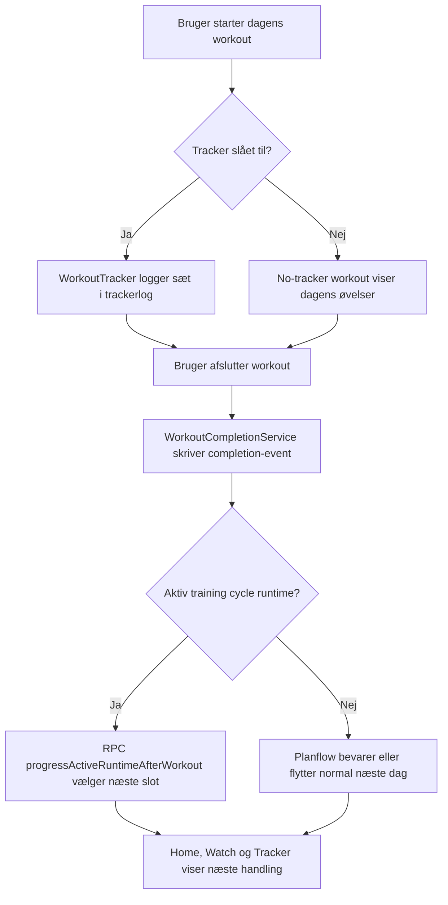

# Rapportklar Arkitekturfortaelling

Dato: 2026-04-28  
Formaal: sammenhaengende rapporttekst om Traeningsmesters arkitektur, software design og kravkobling.  
Kildegrundlag: repoets SwiftUI-, watchOS-, Live Activity-, Supabase-, SQL- og dokumentationsfiler pr. freeze-dato.

## Kort Rapporttekst

Traeningsmester er designet som en native SwiftUI-applikation med Supabase som backend og en tydelig adskillelse mellem brugerflade, applikationsstate, domain models, repositories og backend-sikkerhed. Arkitekturen er valgt for at loese et konkret problem i digitale traeningsforloeb: Brugeren foelger sjældent et program lineært, og appen skal derfor kunne haandtere uplanlagte pauser, tracker-off traeninger, justerede progressioner og forskellige traeningskontekster uden at fremstille afvigelsen som et nederlag.

Den centrale softwareidé er, at "naeste handling" ikke kun beregnes ud fra en simpel dagtaeller. Appen kan i stedet kombinere aktiv plan, tracker runtime, completion-events og en eventuel traeningscyklus-runtime. Det betyder, at brugerens forloeb kan fortsætte stabilt efter en gennemfoert workout, efter et tracker-off pas, efter en pause, eller efter en cyklusstyret deload-uge. Det er en bevidst afvigelse fra en mere lineær planmodel, hvor `plan.current_index` alene ville vaere den autoritative progression.

Arkitekturen er samtidig sikkerhedsorienteret. iOS-, watchOS- og Live Activity-klienterne bruger kun client-safe Supabase anon key og brugerens session. Service-role og eksterne secrets holdes ude af appen og bruges kun i Supabase Edge Functions, hvor admin-, trainer-client-, import- og AI-flows kan valideres server-side. RLS og security definer RPC fungerer som primaer adgangskontrol.

## Arkitektonisk Struktur

Systemet kan beskrives i seks lag:

| Lag | Ansvar | Primaere filer |
| --- | --- | --- |
| Presentation | SwiftUI features, watch UI, widgets og Live Activity views | `Traeningsmester/Features/*`, `TraeningsmesterWatch/*`, `TraeningsmesterLiveActivities/*` |
| Application state | Bootstrap, auth, navigation, profile mode, tracker runtime og cycle runtime | `AppState.swift`, `RootView.swift`, `WatchWorkoutStore.swift` |
| Domain | Typed modeller, payloads, profile mode og routes | `Models.swift`, `Payloads.swift`, `AppProfileMode.swift`, `AppRoute.swift` |
| Data access | Repository-protokoller og Supabase-implementeringer | `RepositoryProtocols.swift`, `SupabaseRepositories.swift` |
| Integration | StoreKit, WatchConnectivity, ActivityKit, App Group, HealthKit og Edge Functions | `StoreKitSubscriptionService.swift`, `WatchAppSyncBridge.swift`, `TrackerLiveActivity*`, `ProgramReviewService.swift`, `TrainerClientService.swift` |
| Backend/security | Postgres schema, RLS, views, RPC, storage og Edge Functions | `SUPABASE_MASTER_SETUP.sql`, `supabase/functions/*` |

Denne lagdeling er ikke kun et teknisk oprydningsvalg. Den goer det muligt at holde forretningslogik ude af views og samtidig lade flere brugerflader, iOS, watch og Live Activity, bruge de samme datakontrakter.

## Fleksibel Programstruktur

Den basale programmodel bestaaar af `plan`, `workout`, `plan_workouts` og `workout_exercises`. Den model er bevidst enkel nok til almindelige programmer, men udvidet med felter og relationslag, der goer den fleksibel:

- `profile_mode` adskiller personlig traening fra traenerkontekst.
- `workout_exercises` indeholder sæt, reps, vægt, pause, isometrisk/effort-relevant logging og supersetmetadata.
- `active_workout_session_state` kan fastholde aktiv session, timer og valgt workout.
- `workout_completion_events` registrerer gennemfoerte pas uafhaengigt af detaljerede trackerlogs.
- `training_cycle_runtime_state` kan overstyre normal planindekslogik, naar en cyklus er aktiv.

Designvalget er metodisk relevant, fordi det adskiller programstruktur fra progressionstilstand. Et program er ikke kun en liste af dage, men et grundlag, som runtime-laget kan fortolke efter brugerens aktuelle situation.

## Motivation Og Afvigelser Fra Plan

Bachelorens problemfelt handler om motivation, adherence og afvigelser fra planlagte forloeb. I implementeringen ses det især i tre designvalg.

For det foerste gemmes afsluttede workouts som completion-events. `WorkoutCompletionPersistenceService` skriver completion til `workout_completion_events` og opdaterer brugerens pending next-day state i settings. Dermed kan en workout tælle som gennemfoert, selvom brugeren ikke har logget alle sæt.

For det andet findes en dedikeret no-tracker route: `workoutTrackerWithoutLogging`. Naar tracker er slukket, sender Home stadig brugeren til dagens traeningsskærm, og `finishTrackerOffWorkout` kalder samme completion-persistens som det fulde trackerflow. Det betyder, at "jeg traenede uden at logge" er en gyldig handling i systemet.

For det tredje kan aktiv traeningscyklus-runtime overtage "naeste workout". `AppState.refreshTrainingCycleRuntimeStateIfPossible` nulstiller normal aktiv planvisning, naar en aktiv runtime findes, og bruger `runtimePreferredWorkoutID` til Home, Tracker og Watch. Efter workout kalder appen progression-RPC, saa naeste uge, dag, deload eller pending end choice afgøres server-side.

Disse valg goer afvigelser haandterbare. Brugeren bliver ikke tvunget til at "rette" appen manuelt efter hvert realistisk brud paa planen.

## Tracker-Off Completion Som Noeglebeslutning

Tracker-off completion er en central designbeslutning, fordi den direkte loeser en konflikt mellem datakvalitet og lav friktion. Detaljerede logs er vaerdifulde, men de maa ikke blive adgangsbilletten til at faa anerkendt en traening.

Det implementerede flow er:

1. Home vaelger normal tracker eller `workoutTrackerWithoutLogging` ud fra tracker-indstillingen.
2. No-tracker visningen henter workout rows uden sætlog-UI.
3. Brugeren afslutter traeningen.
4. `markWorkoutCompletedPersisted` skriver completion-event.
5. Historik, Home og cycle progression kan bruge completion uafhaengigt af `trackerlog`.

Dette er en rapportrelevant afvigelse fra en mere datadrevet fitnessapp, hvor kun fulde logs taeller. Her prioriteres brugerens faktiske traeningsadfaerd og motivation over perfekt registreringsdisciplin.

## Cycle Runtime Og Progression

Traeningscyklusfunktionen er bygget runtime-first. Modellen indeholder `training_cycles`, mesocycles, weeks, day slots, exercise rules, week overrides og runtime state. Runtime state beskriver aktiv uge, blok, dag, deloadstatus, aktiv workout og pending end choice.

Server-side RPC'er har klare roller:

| RPC | Rolle |
| --- | --- |
| `tm_activate_training_cycle_next_training` | Aktiverer cyklus og pauser normal aktiv plan |
| `tm_resolve_active_training_cycle_day` | Finder aktiv runtime for brugeren |
| `tm_progress_training_cycle_after_workout` | Flytter runtime efter gennemfoert workout |
| `tm_handle_training_cycle_end_action` | Haandterer valg ved cyklusafslutning |
| `tm_resolve_training_cycle_targets` | Projekterer sæt/reps/vægt per workout exercise |

Valget er relevant for problemformuleringen, fordi det goer progression adaptiv. En cyklus kan styre en deload-uge, skifte blok eller stoppe ved et valgpunkt uden at omskrive selve workoutmodellen.

## Watch Og Live Activity

Watch- og Live Activity-arkitekturen udvider traeningsflowet til den situation, hvor brugeren ikke naturligt vil bruge hovedappen.

Watch appen modtager session- og settingssnapshot fra iOS via WatchConnectivity. `WatchWorkoutStore` bruger derefter samme repositories til at hente planprogress, cycle runtime, workout exercises, logs og resolved targets. Watch kan ogsaa afslutte workout med `WorkoutCompletionPersistenceService`, saa completion-events og cycle progression ikke er iOS-only.

Live Activity bruger et App Group snapshot med Supabase URL, anon key, brugerens session tokens, aktiv workout, vægtenhed, rest policy og resolved cycle targets. Intents opretter en authenticated anon Supabase-klient, verificerer at rækken tilhoerer aktiv workout, og skriver trackerlog med `client_action_id`. Den unikke databaseindeks paa `("userID", client_action_id)` reducerer duplicate writes.

Metodisk viser dette, at interaktionsdesign og arkitektur haenger sammen. Friktion reduceres i traeningssituationen, men uden at flytte sikkerhedsgraensen ud i klienten.

## Admin- Og Trainer-Boundaries

Traeningsmester har flere aktørtyper: personlig bruger, traener, klient og admin. Arkitekturen behandler disse som adgangsgrænser, ikke kun som UI-varianter.

Trainer-client flows gaar gennem `trainer-client-manage`. Funktionen validerer brugerens session og bruger service-role kun inde i function runtime, hvor relationer, invites og klientoperationer kan kontrolleres. SQL-politikker paa `trainer_clients` og `trainer_client_plan_links` kraever, at den aktuelle bruger er trainer eller client i relationen.

Admin flows gaar gennem `admin-control-center`. Funktionen kalder `tm_current_user_is_admin` eller kontrollerer `user_settings.is_admin` server-side, foer den tillader bruger-CRUD, activity feed eller exercise review. Lokal admin UI-state kan derfor ikke alene give adgang.

Dette er vigtigt i rapporten, fordi fleksibilitet ikke maa blive lig med ukontrolleret tværbrugeradgang. Systemet understotter samarbejde, men autorisationen ligger i backend.

## Diagramspor

De eksisterende diagramkilder kan bruges som rapportens visuelle spor:

| Diagram | Fil | Rapportbrug |
| --- | --- | --- |
| System context | `diagrams/src/system_context.mmd` | Viser aktører, iOS, watch, Live Activity, Supabase og Apple services |
| Container architecture | `diagrams/src/container_architecture.puml` | Viser lagdeling mellem features, AppState, repositories, support services og backend |
| Data model ERD | `diagrams/src/data_model_er.mmd` | Viser plan/workout/tracker/completion/cycle relationer |
| Tracker BPMN | `diagrams/src/tracker_flow.bpmn` | Viser tracker-on, tracker-off, completion og cycle progression |
| Authorization DCR | `diagrams/src/authorization_dcr.md` | Viser betingelser for auth, RLS, admin, trainer-client og Live Activity writes |

Særligt tracker BPMN og ERD bør bruges sammen: BPMN forklarer processen, mens ERD viser hvorfor processen kan gemmes som gyldige data.

## Supplerende Procesdiagram Til Rapporttekst

Dette tekstdiagram kan bruges som kort forklaring i rapporten, hvis det er nyttigt at samle tracker-off, completion og cycle runtime i én figur:

Diagrammet skal ikke erstatte de eksisterende kilder, men kan bruges som rapportnær opsummering.

## Use Case Og Kravkobling

| Rapporttema | Use cases | Krav | Arkitekturspor |
| --- | --- | --- | --- |
| Login, bootstrap og sikker klientkonfiguration | UC-01 | F-01, F-02, NF-01, NF-02 | `AppEnvironment`, `AppState`, RLS |
| Onboarding og overgang fra eksisterende vaner | UC-02, UC-11 | F-11, F-12, NF-08 | `OnboardingModels`, `TMOnboardingFlowView`, `ProgramReviewService`, import Edge Functions |
| Fleksibel programstruktur | UC-03, UC-04 | F-03, F-04, F-05, NF-06 | `PlanRepository`, `WorkoutRepository`, `WorkoutExercisePayload`, ERD |
| Tracker og tracker-off completion | UC-06 | F-08, F-09, F-10, F-15 | `WorkoutTrackerView`, `WorkoutCompletionService`, `tracker_flow.bpmn` |
| Cycle runtime | UC-08 | F-13, F-08, F-14 | `TrainingCycleRepository`, cycle RPC, `TrainingCycleRuntimeContext` |
| Watch companion | UC-07 | F-14, F-08, F-09, NF-07 | `WatchAppSyncBridge`, `WatchWorkoutStore` |
| Live Activity | UC-06 | F-15, F-08, NF-07 | `TrackerLiveActivitySharedStore`, `TrackerLiveActivityIntents`, `client_action_id` |
| Trainer-client | UC-09 | F-16, NF-02 | `TrainerClientService`, `trainer-client-manage`, RLS policies |
| Admin | UC-10 | F-17, NF-01, NF-02 | `admin-control-center`, `tm_current_user_is_admin`, activity events |

## Metodisk Relevans

Arkitekturen er relevant for bachelorens metode, fordi den goer det muligt at koble problem, krav, implementering og evaluering:

- Problemfeltet handler om motivation og realistiske afvigelser.
- Use cases beskriver de konkrete brugerhandlinger, hvor afvigelser opstaar.
- Kravtraceability viser, hvilke tekniske krav der skal opfyldes.
- Beslutningsloggen forklarer, hvorfor systemet er designet saadan.
- Diagrammerne viser strukturen visuelt.
- Test- og buildartefakter i `06_verifikation` dokumenterer, at centrale dele er verificeret i denne bachelor-run.

Den vigtigste arkitektoniske pointe er, at fleksibiliteten ikke er placeret som spredte UI-undtagelser. Den er modelleret i datalag og runtime-lag: profile mode, completion-events, active session state, cycle runtime, idempotency keys og servervaliderede boundaries. Det goer loesningen mere rapporterbar, fordi designbeslutningerne kan spores til konkrete filer, tabeller, RPC'er og tests.

## Kort Konklusion Til Rapporten

Traeningsmesters arkitektur understotter bachelorens problemformulering ved at flytte progression fra en enkelt lineær planindeksmodel til en kombination af programstruktur, completion-events og runtime-state. Brugeren kan derfor gennemfoere, springe logging over, traene fra watch, bruge Live Activity eller foelge en avanceret cyklus uden at systemet mister sammenhaeng. Samtidig fastholdes sikkerhedsmodellen gennem anon-klient, RLS, RPC og Edge Functions. Det goer appen baade mere fleksibel for brugeren og mere efterproevbar som softwareprojekt.
