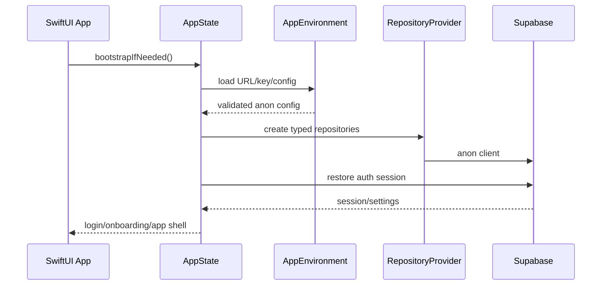
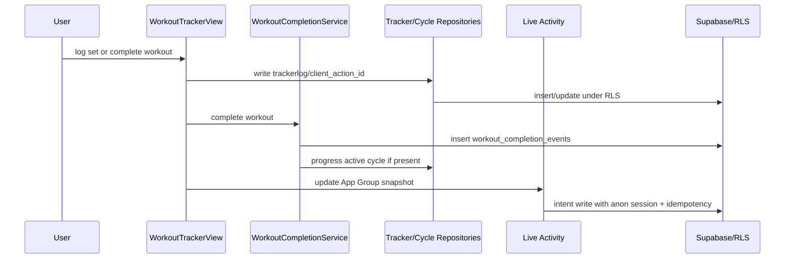
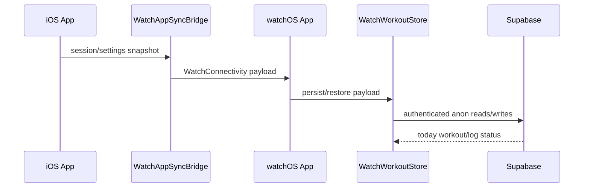

# Dataflow

## Bootstrap Og Auth

```mermaid
sequenceDiagram
  participant App as SwiftUI App
  participant State as AppState
  participant Env as AppEnvironment
  participant Repo as RepositoryProvider
  participant SB as Supabase

  App->>State: bootstrapIfNeeded()
  State->>Env: load URL/key/config
  Env-->>State: validated anon config
  State->>Repo: create typed repositories
  Repo->>SB: anon client
  State->>SB: restore auth session
  SB-->>State: session/settings
  State-->>App: login/onboarding/app shell
```

## Tracker, Completion Og Cykler

```mermaid
sequenceDiagram
  participant User
  participant Tracker as WorkoutTrackerView
  participant Completion as WorkoutCompletionService
  participant Repo as Tracker/Cycle Repositories
  participant Live as Live Activity
  participant SB as Supabase/RLS

  User->>Tracker: log set or complete workout
  Tracker->>Repo: write trackerlog/client_action_id
  Repo->>SB: insert/update under RLS
  Tracker->>Completion: complete workout
  Completion->>SB: insert workout_completion_events
  Completion->>Repo: progress active cycle if present
  Tracker->>Live: update App Group snapshot
  Live->>SB: intent write with anon session + idempotency
```

## Watch Sync

```mermaid
sequenceDiagram
  participant iOS as iOS App
  participant Bridge as WatchAppSyncBridge
  participant Watch as watchOS App
  participant Store as WatchWorkoutStore
  participant SB as Supabase

  iOS->>Bridge: session/settings snapshot
  Bridge->>Watch: WatchConnectivity payload
  Watch->>Store: persist/restore payload
  Store->>SB: authenticated anon reads/writes
  SB-->>Store: today workout/log status
```

